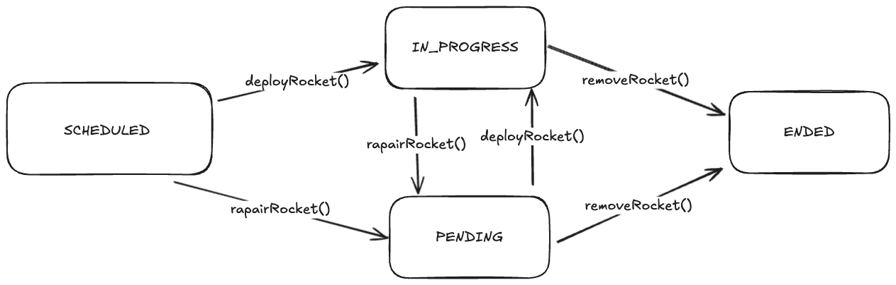

# Space Dragon Readme

### Assumptions
1. Each rocket and mission is unique by its `Name`.
2. Rocket deployment changes the status of mission to `In progress` and rocket state to `In space`.
3. Rocket in repair changes mission status do `Pending` even if other rocket is in space.
4. When removing rocket from mission and mission has no remaining rockets, Mission goes into `Ended` state.

### Mission State diagram

### Technical Information
- Data stored in Database interface - public and static by default.
- `MisssionService` and `ReportingService` act as a facade.
- Introduced custom exceptions for easier debugging.

### Further investigation/development
- Prevent changing mission state to in progress even if there is one rocket in repair.
- Optimize report generation by making calculations in the DB.
- Change order of assigned rockets in report feature.
- Make `Missions` in Database a `HashSet`.